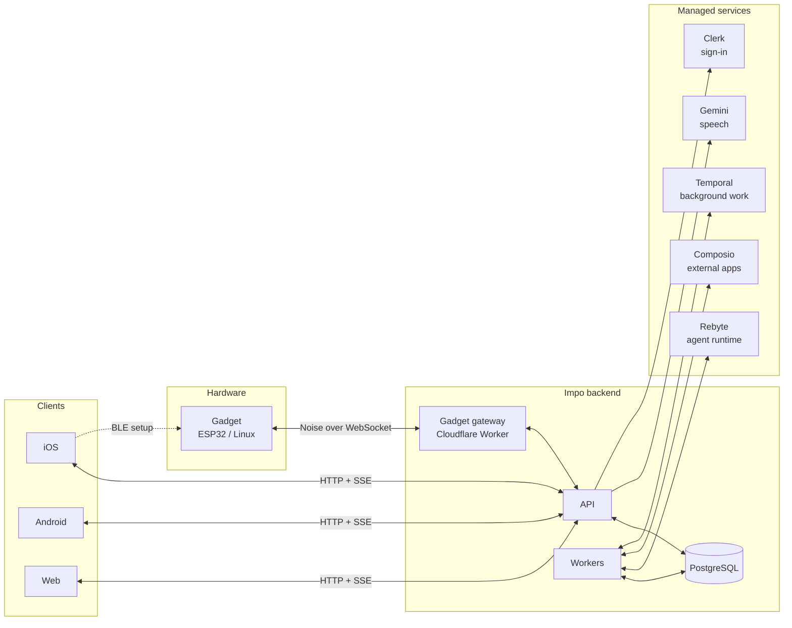

<p align="center">
  
</p>

# Impo

**Open source framework for personal agents**

Impo gives you a personal agent that lives across your phone, the web and your
own hardware. Talk to it, hand it tasks, let it remember what matters, and let
it act in the apps you connect and on the gadgets you pair.

[Website](https://impo.ai) · [Web app](https://impo.ai/app/) · [Gadget SDK](https://github.com/impoai/impo-gadget-sdk) · [Discord](https://discord.gg/84ZYn3xcGV) · [Docs](docs/README.md)

## What you get

- **Chat** – one conversation with your agent, streamed, resumable, on every device.
- **Tasks** – delegate work; each task runs in its own conversation and reports back.
- **Feed** – background agents prepare briefings and suggestions from your context.
- **Echo** – capture spoken context; confirm your own voice before it is used.
- **Memory** – long-term memories built from chat and Echo, retrieved before each reply.
- **Connections** – 100+ external apps through Composio, plus calendar, health, reminders and contacts on the phone.
- **Gadgets** – pair ESP32 or Linux hardware over Bluetooth; the agent can show, play and move things on it, and the gadget can talk back.

Clients: native iOS (SwiftUI), native Android (Kotlin/Compose) and Web (React).
All three speak the same API.

## Architecture



How a message flows: a client posts it to the API, which records it and queues
work. A worker runs the turn on Rebyte and streams the reply back over SSE.
Tool calls go through Impo's dispatcher: native tools run on the user's phone,
external apps run through Composio, gadget commands go through the gateway,
and the rest run inside the server. The user owns every record; provider
credentials never leave the server.

Gadgets speak the open-source [Muse Gadgets](https://github.com/facebookincubator/muse-gadget-sdk)
link protocol. Our [fork](https://github.com/impoai/impo-gadget-sdk) only changes
the default addresses and names, so any Muse-compatible gadget can pair with Impo.

## Repository layout

```text
ios/          iOS app and Swift client package
android/      Android app and Kotlin client
web/          Web app
server/       API, workers, tools, database schema
server/gadget-gateway/   Cloudflare Worker that terminates the gadget protocol
contracts/    Client protocol shared by every frontend
docs/         Architecture and feature guides
```

Impo was previously named Instant; identifiers such as `InstantClient` and
`INSTANT_*` remain for compatibility.

## Run it locally

You need Node.js 22, PostgreSQL binaries on your path, and Xcode for the iOS app.

```sh
git clone https://github.com/impoai/impo.git
cd impo
npm ci
cp .env.example .env
npm run db:start && npm run db:push && npm run db:seed
npm run dev:api      # http://127.0.0.1:3001
npm run dev:worker   # in a second terminal
```

The default `.env` uses local identities and a deterministic runtime, so no
model keys are needed. For real conversations set `INSTANT_RUNTIME=rebyte` and
`REBYTE_API_KEY`; see the [server guide](server/README.md) for every optional
service.

To open a client:

- **iOS** – `node scripts/ios-app.mjs generate && open ios/App/Instant.xcodeproj`, then point the app at your local server in its development settings. See the [iOS guide](ios/App/README.md).
- **Android** – `npm run build:android`, or install the signed build from [impo.ai/android.apk](https://impo.ai/android.apk). See the [Android guide](android/README.md).
- **Web** – see the [Web guide](web/README.md).

`npm test` runs the server and protocol checks without any credentials.

## Community

Questions, ideas and contributions are welcome in the
[Impo Discord](https://discord.gg/84ZYn3xcGV). Read [SECURITY.md](SECURITY.md)
before configuring provider credentials.

## License

[MIT](LICENSE). Third-party materials keep their own licenses; see
[third-party notices](THIRD_PARTY_NOTICES.md).
