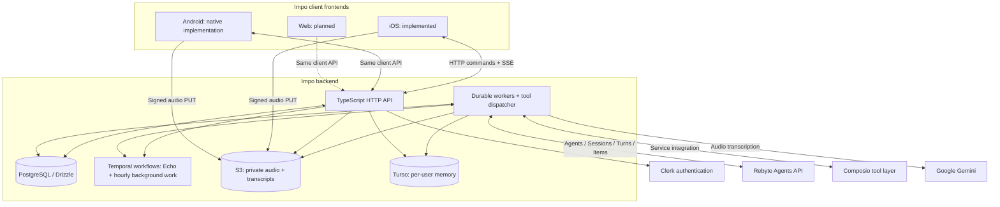

<p align="center">
  
</p>

# Impo

**An open-source personal agent for iOS, Android, and the web.**

Impo is a personal agent in the spirit of MUSE: a companion that understands your everyday
context, helps you get things done, and follows up proactively. Talk to your agent,
delegate a task, capture spoken thoughts with Echo, and get daily briefings in Brief.

The project covers the full stack: client frontends, the application API, background
workers, data storage, and agent integration. **The backend and native iOS client
are implemented; the native Kotlin/Compose Android client has passed its build,
unit tests and local emulator acceptance. Web remains planned.** Clients share the
same backend and conversation model, with native capabilities adapted to each
platform. Work continues on the server when a client disconnects.

[Website](https://impo.ai) · [Discord](https://discord.gg/84ZYn3xcGV) · [Roadmap](#roadmap) · [Documentation](docs/README.md) · [iOS setup](ios/App/README.md) · [Android setup](android/README.md) · [Server setup](server/README.md)

## What Impo does

| Capability | How it works |
| --- | --- |
| **Chat** | One main conversation per user, with a reusable Rebyte Session, streamed replies, history recovery, and explicit cancellation. |
| **Tasks** | Delegate work from chat or start a task directly. Each task has its own conversation and agent Session. |
| **Brief** | Background agents generate briefings using the user's language, time zone, and configured brief times. Card editions accumulate across days and can be captured as PNG or PDF. |
| **Echo** | Capture spoken context, upload immutable audio batches, and browse transcripts with recording-time places and optional labels. |
| **Memory** | Consolidate chat and Echo evidence into per-user memories, with categories, expiry and forgetting. Main Chat retrieves relevant memories before each reply. |
| **Integrations** | Connect the agent to external services through Composio and to native capabilities through permissioned device adapters. |

External apps come from **Rebyte's Composio shelf** (about 120 apps), with
discovery, authorization, and execution behind four fixed connector tools rather
than per-app tools. The tools available to a user depend on connected accounts and
granted permissions.

The project is under active development. Some settings and subscription screens
are demos. iOS and Android support native hold-to-talk voice input through
Apple Speech and Android SpeechRecognizer, respectively.
Background long-term memory and main-chat retrieval
are implemented; profile extraction and diary generation remain planned. The platform
roadmap below describes how Impo expands beyond the first iOS client.

## Roadmap

Impo is being built as a complete open-source personal agent across mobile and web.
The backend and client protocol are shared foundations; each frontend owns its
interface and platform-specific permissions. The plan is organized by milestones,
without fixed release dates.

| Area | Status | Plan |
| --- | --- | --- |
| **Backend and agent execution** | Implemented; evolving | Continue improving durable runs, recovery, tool integrations, and developer setup. Keep one API for all clients. |
| **iOS frontend** | Implemented; evolving | Refine chat, Tasks, Brief, Echo, native permissions, and background behavior. |
| **Android frontend** | Signed APK; emulator verified | Kotlin/Compose app for Chat, Tasks, Brief, Memories, Echo, connections and native permissions. [Download for testing](https://impo.ai/android.apk); physical-device and full account acceptance remain pending. |
| **Web frontend** | Planned | Bring chat, task management, Brief, and Echo history to the browser through the same authenticated API. Add browser-supported capture where practical. |
| **Shared client contracts** | Implemented foundation; expanding | Extend protocol fixtures and recovery tests so clients share consistent identity, history, task state, and tool results. |
| **Composio integrations** | Rebyte connector shelf implemented | Add per-action confirmation for sensitive writes. |
| **Personal context** | Background memory and main-chat retrieval implemented | Expand proactive assistance using relevant personal context. |

The repository contains the backend, iOS app, and native Android app plus its
independent Kotlin protocol library. Android build, unit and emulator checks have
passed; recording and device tools still require physical-device checks. The Web frontend has not
been started.

## Architecture

Impo has three main layers: client frontends, a shared application backend, and a
managed agent runtime. Clients use the Impo API for commands and temporary S3
URLs for audio uploads; provider credentials stay on the server. Dashed connections
show planned clients.



### Responsibilities

| Component | Owns |
| --- | --- |
| **Client frontends** | User interfaces, streamed replies, history recovery, capture, and platform permissions. iOS and Android are implemented; Android has passed local emulator acceptance; Web is planned. |
| **Shared client contracts** | Authenticated HTTP commands, SSE message formats, recovery, and device dispatch. Each frontend implements the same protocol using its platform's networking stack. |
| **API server** | Authentication, resource ownership, command acceptance, history queries, and stream subscriptions. |
| **Workers** | Agent input submission, runtime reconciliation, tool dispatch, output projection, retries, and recovery after process restarts. |
| **PostgreSQL + Drizzle** | Application identity, conversations, ownership, execution records, tool receipts, connector bindings, and Brief editions. |
| **Rebyte** | Managed agent execution and stateful Sessions, Turns, and Items. Impo uses the pinned `@rebyteai/agent-sdk` through `client.beta.agents`. |
| **Temporal** | Durable audio-batch coordination and per-user hourly background workflows. It schedules application work that can invoke Rebyte Agents. |
| **Tool integration layer** | Service discovery, account authorization, and tool execution through Composio, plus native-device adapters and internal application services. Every app on Rebyte's Composio shelf is available. |

### Conversations and tools

1. The client sends a message with a stable idempotency key. The API checks
   ownership and atomically records the accepted message and queued work.
2. A worker creates or reuses the user's main Rebyte Session. Each user has a
   lazily created Saved Agent; independent tasks use isolated Sessions with
   inline agent configurations.
3. The worker subscribes to runtime events and reconciles Turns and Items.
   The client receives updates over the Vercel UI Message Stream v1 format.
4. Function calls go through Impo's dispatcher: **device tools** run on the
   authorized client device, **external-service tools** run through Composio on
   the server, and **internal tools** operate application services such as task creation.
5. A disconnected stream can be reopened and history recovered. Closing the
   stream ends the subscription; cancellation is a separate command. Device
   work waits for the target device to become available or reaches its deadline.

Tool calls have explicit ownership, claims, deadlines, and saved results.
The current native client saves a device result before returning it, so retries
can reuse that receipt. Workers use database leases and reconcile uncertain remote creation
attempts before creating another Agent or Session.

### Echo and Brief

**Echo:** microphone → on-device voice detection → durable local audio batches
→ signed S3 upload → API confirmation → independent Temporal job → Gemini
transcription → transcript timeline. Checksum-bound files and stable batch IDs
support retries and offline recovery. The API verifies the stored file and durable
job before local audio is removed; failed jobs retain S3 audio for retry.

**Brief:** a separate per-user Temporal workflow wakes hourly, checks the user's
briefing preferences, and invokes a dedicated Rebyte Agent when a brief is due.
Results are saved as new card editions with source and runtime provenance.
The workflow continues as new after 24 ticks to bound its execution history.
Rebyte's Schedule API is not used.

## Repository layout

```text
ios/          iOS frontend: app, client package, native adapters, and tests
android/      Kotlin/Compose app, independent protocol client, native adapters and tests
web/          Web frontend: planned; directory not created yet
server/       Shared API, workers, agent integration, tools, and database schema
contracts/    Shared client protocol and test fixtures
docs/         Architecture, client API, and implemented feature behavior
scripts/      Local development and cross-platform verification
```

The planned Web frontend will have its own top-level directory when implementation
starts. Shared client contracts remain in `contracts/`; all client frontends reuse
the API and workers in `server/`.

Impo was previously named Instant. Existing identifiers such as `InstantClient`,
the `Instant` Xcode scheme, `INSTANT_*` environment variables, and ICA v1 remain
in use for compatibility. Use those exact identifiers in commands and code.

## Run locally

### Prerequisites

- Node.js 22 or later and npm.
- PostgreSQL server binaries: `postgres`, `initdb`, `pg_ctl`, `psql`, and `createdb`.
- macOS, Xcode with a Swift 6 toolchain, and XcodeGen for the native app.

Run commands from the repository root. The root npm workspace coordinates
installation and tests; server dependencies live in `server/package.json`.

### Start the API and worker

```sh
git clone https://github.com/impoai/impo.git
cd impo
npm ci
cp .env.example .env
npm run db:start
npm run db:push
npm run db:seed
```

For an existing checkout, keep your existing `.env`. The default configuration
uses local development identities and a deterministic echo runtime, so this
path needs no model credentials. The database runs under `.local/postgres/`
on port `55432`. Start each process in its own terminal:

```sh
npm run dev:api
```

```sh
npm run dev:worker
```

The API listens on `http://127.0.0.1:3001`. Check `/health` for process health and
`/ready` for database readiness. To enable real conversations, set
`INSTANT_RUNTIME=rebyte` and `REBYTE_API_KEY` in the server's `.env`, then restart
both processes. See the [server guide](server/README.md) for configuration.

### Open the iOS app

```sh
node scripts/ios-app.mjs generate
open ios/App/Instant.xcodeproj
```

Select the `Instant` scheme and an iOS Simulator. Configure your own Clerk keys
for real sign-in, or add `--show-main` to the scheme launch arguments to explore
the offline interface. No maintainer credentials are included. In the app's
development settings, enable the local API server and use
`http://127.0.0.1:3001`. The app targets iOS 18 or later. Physical devices need
your own signing configuration and a reachable server address; see the
[iOS app guide](ios/App/README.md).

### Open the Android app

Install the latest signed testing build from **[impo.ai/android.apk](https://impo.ai/android.apk)**
on Android 9 or later. The download URL stays the same across releases. Version,
size and SHA-256 are available in the [release metadata](https://impo.ai/android/latest.json).

Install JDK 17, Android SDK Platform 36 and the API 35 Google APIs arm64 emulator
image. Run the following from the repository root:

```sh
npm run test:android
npm run build:android
npm run android:emulator
```

Start `npm run dev:android-fixture` in another terminal, then run
`npm run android:launch -- --fixture` to explore with synthetic local records.
`npm run test:android:ui` owns its own fixture and emulator test lifecycle.
For deployed sign-in, configure your API URL and Clerk publishable key in
untracked `android/local.properties`. See the [Android guide](android/README.md)
for account, permission and physical-device validation boundaries. Android's
86 unit tests, protocol integration and 12 API 35 instrumentation tests passed.
The signed build uses the production API and supports Google/Apple OAuth.
Production provider initiation and both Google/Apple login pages were verified;
full account login and physical-device acceptance remain pending. See the
[release workflow](android/README.md#publish-the-android-download) to update the
permanent download using the existing signing key.

### Optional services

| Feature | Configuration |
| --- | --- |
| Real agent conversations and tasks | Rebyte API key and `INSTANT_RUNTIME=rebyte`. |
| External-service integrations | Composio credentials, connector configuration, and user authorization for enabled services; see the server guide. |
| Echo upload and transcription | Private S3 bucket and service-role access, Temporal address/namespace, and a Gemini API key. |
| Brief briefings | Temporal and the Rebyte runtime. |
| Long-term memory | Turso provider configuration; see `.env.example`. |
| Deployed authentication | `INSTANT_AUTH_MODE=clerk` and your Clerk configuration. Local demo tokens are for local development. |

During development, edit the Drizzle schema directly and run `npm run db:push`.
The repository does not maintain SQL migration histories or Drizzle snapshots.

## Verification

| Command | Coverage |
| --- | --- |
| `npm test` | TypeScript checks/tests, Swift tests, and HTTP/SSE integration against a local fixture; no model key or database required. |
| `npm run test:android` / `npm run build:android` | Kotlin client and non-UI app tests / debug APK compilation. |
| `npm run test:android:ui` / `npm run lint:android` | Native emulator/Compose smoke over a local API fixture / Android lint. |
| `npm run test:ios` | Swift protocol tests on a temporary iOS Simulator. |
| `npm run test:db` | Durable execution and ownership against an isolated PostgreSQL database. |
| `npm run test:rebyte` | SDK integration and recovery using a local Rebyte protocol double. |
| `npm run test:devices` / `npm run test:connectors` | Device dispatch and external-tool ownership/recovery. |
| `npm run test:listening` / `npm run test:listening-batches` | Recording and batch persistence; batch tests also require the Temporal CLI. |
| `npm run test:background` / `npm run test:today` / `npm run test:memory` | Hourly workflows and briefing generation; background tests require the Temporal CLI. |
| `npm run test:live` | Real Rebyte acceptance using your configured development organization and credentials. |

Native permissions, microphone behavior, and long-running background recording
also require physical-device verification. Simulator and protocol tests cover
different boundaries; the feature guides record those limits.

## Community

Join the [Impo Discord community](https://discord.gg/84ZYn3xcGV) and head to
**#discussion** to ask questions, share ideas, get setup help, and discuss
contributions across the backend, iOS, Android, and Web.

## Documentation

Start with the [documentation map](docs/README.md), [server guide](server/README.md),
[iOS guide](ios/App/README.md) and [Android guide](android/README.md). Read [security guidance](SECURITY.md) before
configuring provider credentials. Third-party material retains the licenses
listed in [third-party notices](THIRD_PARTY_NOTICES.md).

## License

Impo is available under the [MIT License](LICENSE). Third-party materials retain
their own licenses; see [third-party notices](THIRD_PARTY_NOTICES.md).
