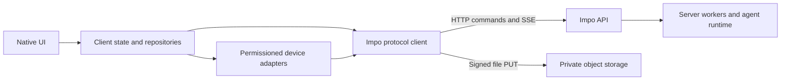

# Impo application protocol v1

Status: documented baseline of the implemented API, reviewed 2026-09-30.
This contract is shared by the Swift iOS client and the Kotlin Android client.
Android sources implement this protocol; initial Android build and emulator
acceptance are tracked in the [platform guide](../android/README.md).

The protocol uses authenticated HTTP commands/queries, Vercel UI Message Stream
v1 over SSE, and separate server-authorized object uploads. Historical ICA and
`instant` identifiers remain wire-compatible. Product names Brief and Echo do
not rename the `today` and `listening` routes.

## Boundaries



- The server owns identity mapping, resource ownership, durable execution,
  conversations, tasks, Brief, memory and third-party connections.
- The client owns presentation, OS permissions, recording, immutable local
  upload files, device receipts and subscription recovery.
- UI code consumes application state. It does not parse SSE, manage tokens,
  compose agent instructions, call providers or decide upload durability.
- Clerk signs in the user. Impo consumes its bearer token; there is no Impo
  username/password endpoint. Provider secrets never enter the client.
- A stream observes a run. Closing the stream does not cancel the run.
- Device execution requires the owned pending/claim/result flow. Replaying
  a tool event renders it; it does not authorize native execution.

## Common wire rules

The configured base URL excludes `/api/v1`. It may contain a deployment prefix
such as `/instant`; append paths without discarding it. Use HTTPS outside
explicit local development. Paths below are relative to `/api/v1`, except the
operational `/health` and `/ready` endpoints.

Send `Authorization: Bearer <session token>` and `Content-Type: application/json`
for JSON commands. JSON is UTF-8. Obtain credentials at request time; do not
persist tokens in upload jobs or log credentials, signed URLs or user content.
The deployed API verifies Clerk sessions. `instant-dev-alice`/`instant-dev-bob`
are only for the explicitly enabled local development API. The separate
protocol double uses `instant-test-*` and fixture-only `scenario` fields; those
are not production API inputs.

Decode additional response fields tolerantly. Send only documented request
fields: most commands reject unknown fields. Ownership comes from the bearer
session, never a client-supplied `userId`. Another user's resource normally
returns `404`, including inaccessible device invocations.

Notation below describes JSON, not a shared language SDK: `?` marks an optional
property, `T | null` permits JSON null, `T[]` is an array, and `JSON` is a JSON
value. Resource IDs are UUID strings unless stated otherwise. Client message
and installation IDs are nonblank strings of at most 256 UTF-16 code units,
without NUL; fresh UUIDs are suitable. Timestamps include an offset or `Z`;
client context and native-tool timestamps accept at most three fractional-second
digits. New clients should emit canonical UTC millisecond timestamps such as
`2026-09-30T08:00:00.123Z`, including when sealing audio metadata; preserve sealed
bytes unchanged on retries. Calendar dates are `YYYY-MM-DD`; time zones are IANA names. Cursors are opaque
and scoped to their original query.

Ordinary JSON bodies are limited to 64 KiB; character limits do not override
byte limits. Upload preparation permits 384 KiB of metadata. Sealed Echo files
have separate limits. Query integers use decimal digits without signs,
fractions or leading zeroes. Do not duplicate query parameters.

Error responses retain the HTTP status and use this envelope:

```json
{
  "error": {
    "code": "idempotency_conflict",
    "message": "Message ID already has different content",
    "retryable": false
  },
  "requestId": "6f93d88e-0198-48cf-93ed-c70998c3544b"
}
```

`X-Request-Id` is also a response header. Treat non-JSON proxy errors as HTTP or
transport failures, not empty success. Preserve unfamiliar error codes. Refresh
a rejected token at most once per request and retry the exact body/IDs. A second
`401` requires sign-in. Coordinate concurrent refreshes and cancel account-scoped
work on sign-out/account change.

Retry transient failures with bounded backoff/jitter; respect `Retry-After` on
`429`. Retrying means the same operation, not a new message/batch identity. Do
not automatically retry every write: OAuth connect has no client idempotency
key, for example; reconcile its status. `409` conflicts need reconciliation;
`410` means work is no longer usable. A lost response does not prove failure.

## Account profile

| Method and path | Request | Success |
| --- | --- | --- |
| `GET /profile` | None | 200 `AccountProfile` |
| `PATCH /profile` | Optional `assistantName`, `avatarIndex`, `onboarded` | 200 `AccountProfile` |

`AccountProfile` contains `onboarded: boolean` and optional `displayName`,
`assistantName`, and `avatarIndex`. The assistant name is trimmed and must have
1–30 characters without NUL. Avatar indices are stable: fox 0, robin 1, cat 2,
Impo 3, owl 4, otter 5, and iOS device-local photo 6. The API does not transfer
photo bytes. `onboarded` may only be set to `true`; old accounts with a user
message also count as onboarded. Unknown patch fields are rejected.

`displayName` is read from Brief settings. To change it, fetch current
`GET /today/settings` and preserve the other editable fields in
`PUT /today/settings`. Do not send it to `PATCH /profile`. OS permissions,
native connection opt-ins and upload preferences remain local to each account
on each device. A failed first profile lookup is unknown, not a new account;
show recovery/retry instead of overwriting the remote profile with defaults.
Pending profile edits persist before network writes. Scope asynchronous results
to the originating login session, including when the same user signs in again.

## Chat, tasks and runs

| Method and path | Request | Success |
| --- | --- | --- |
| `GET /conversation` | `afterSequence=0`, `limit=50` (1–100) | 200 `ConversationPage` |
| `POST /conversation/messages` | `MessageCommand`, optional `deviceId` | 202 `MessageReceipt` |
| `POST /conversation/voice-messages` | `VoiceMessageCommand`, optional `deviceId` | 202 `VoiceMessageReceipt` |
| `POST /voice/transcriptions` | `VoiceClip` | 200 `{text: string}` |
| `GET /tasks` | No query | 200 `{tasks: TaskSummary[]}` |
| `POST /tasks` | `MessageCommand`, text max 4,000 code units; no `deviceId` | 202 `TaskReceipt` |
| `GET /tasks/{taskId}/conversation` | Same pagination as main conversation | 200 `TaskConversationPage` |
| `POST /tasks/{taskId}/messages` | `MessageCommand`; no `deviceId` | 202 `MessageReceipt` |
| `GET /submissions/{submissionId}` | No query | 200 `Submission` |
| `GET /submissions/{submissionId}/stream` | `Accept: text/event-stream`; no query | 200 SSE |
| `POST /submissions/{submissionId}/cancel` | `{}` | 200 `Submission` |

```text
ClientContext = { timeZone: string, currentDate: timestamp }
MessageCommand = { clientMessageId: string, text: string, clientContext?: ClientContext }
MessageReceipt = { messageId: UUID, submissionId: UUID }
TaskReceipt = { taskId: UUID, conversationId: UUID, messageId: UUID, submissionId: UUID }
VoiceClip = { audio: base64 string (decoded max 2 MiB), mimeType: "audio/mp4" | "audio/m4a" | "audio/aac" |
              "audio/mpeg" | "audio/wav" | "audio/ogg" | "audio/webm" | "audio/flac" }
VoiceMessageCommand = VoiceClip + { clientMessageId: string, clientContext?: ClientContext }
VoiceMessageReceipt = MessageReceipt + { text: string }
Submission = { submissionId: UUID, messageId: UUID, status: string,
               resultCount: integer, subscriberCount: integer,
               version: integer, cancelRequested: boolean,
               error: {code: string, message: string, retryable?: boolean} | null }
Message = { id: UUID, role: string, sequence: integer, text: string,
            status: string, createdAt: timestamp, parts?: JSON[] }
ActiveSubmission = { submissionId: UUID, messageId: UUID, status: string }
ConversationPage = { conversationId: UUID, messages: Message[],
                     activeSubmissions: ActiveSubmission[], hasMore: boolean,
                     nextAfterSequence: integer }
TaskConversationPage = ConversationPage + { taskId: UUID, title: string }
TaskSummary = { taskId: UUID, conversationId: UUID, title: string, status: string,
                createdAt: timestamp, updatedAt?: timestamp,
                lastRunStartedAt: timestamp | null, lastRunCompletedAt: timestamp | null }
```

A voice message is one command: the server transcribes the clip, accepts the
transcript as that user message and starts its reply before responding, so the
client shows a pending bubble until `text` arrives and then subscribes as usual.
Retrying the same `clientMessageId` returns the originally accepted text without
transcribing again. A clip without speech fails with 422 `empty_transcript` and
accepts nothing; provider failures are 503 `transcription_unavailable`. Use
`/voice/transcriptions` when the text should land somewhere other than chat, such
as a new task. Neither route stores audio.

Each user has one main conversation; task conversations are isolated. Ordinary
message text is nonblank, without NUL and at most 32,768 UTF-16 code units.
`currentDate` is a full timestamp despite its name. Freeze the complete command,
including clock context and device ID, before the first attempt. The same
`clientMessageId` and content recover the original receipt; changed content or
conversation returns `409 idempotency_conflict`. IDs are user-scoped: do not
reuse one across main chat and tasks.

The receipt's `messageId` identifies the **user** message. The submission and
SSE `start.messageId` identify the **assistant** message. Keep both identities.
`202` means accepted, not completed. Run states are `queued`, `running`,
`waiting_device`, `completed`, `failed`, `cancelled`; the last three are terminal.
Task states are separately `queued`, `in_progress`, `completed`, `failed`,
`cancelled`. Cancellation can race with completion; repeated cancellation does
not change a completed run to cancelled.

The persistent API includes `version`, `cancelRequested` and `error`; the older
fixture omits them. `version` is diagnostic, not a stream-resume cursor. In the
Rebyte runtime, cancel can first return `cancelRequested: true` while the run is
still active. Continue observing until terminal; do not infer completion from
the cancel response alone. `parts` in history is optional for clients and does
not promise reconstruction of the full live progress UI.

Load history from sequence zero; follow `nextAfterSequence` while `hasMore`.
Merge by message ID in sequence order. On reconnect/relaunch, refresh history
and subscribe to active submissions. A sequence cursor only finds later messages;
it does not refresh an earlier running assistant message. Do not rely solely on
incremental history to recover its final contents. Recover the accepted run
instead of submitting its prompt again.

History exposes text/status, not the full transient tool/progress UI. Markdown,
tables, code and LaTeX are client rendering concerns. Search is currently local.

## SSE framing and reduction

Validate `Content-Type: text/event-stream` and
`x-vercel-ai-ui-message-stream: v1`. Each subscription reconstructs the message
from the beginning, then streams new events. There is no client event cursor or
`Last-Event-ID` resume contract. Use a fresh reducer per response and replace
the prior message by stable ID; never append a replay to existing text.

Network reads may split UTF-8 characters or delimiters. Support LF, CRLF and CR,
an initial UTF-8 BOM, multiline `data:` joined by a newline, and comment
keepalives. Dispatch on an empty line; ignore unrelated SSE fields. Bound the
buffer (iOS uses 1 MiB per event), reject invalid UTF-8 and detect truncated EOF.

| Chunk `type` | Fields beyond `type` | Client action |
| --- | --- | --- |
| `start` | `messageId` | Establish the assistant message |
| `text-start` | `id` | Open a text block |
| `text-delta` | `id`, `delta` | Append to that open block |
| `text-end` | `id` | Close the block |
| `tool-input-available` | `toolCallId`, `toolName`, `input: JSON` | Render a tool call |
| `tool-output-available` | `toolCallId`, `output: JSON` | Attach its result |
| `tool-output-error` | `toolCallId`, `errorText` | Attach its error |
| `data-instant-submission` | `data: {schemaVersion: 1, submissionId, status}` | Update run state |
| `data-instant-device-request` | `data: {schemaVersion: 1, invocationId, toolCallId, deviceId, expiresAt}` | Signal device work; claim separately |
| `data-instant-step` | `id`, `data: {schemaVersion: 1, kind, title, status, detail?, result?}` | Upsert transient progress by ID |
| `error` | `errorText` | Record error; reconcile run state |
| `abort` | No required additional fields | Mark aborted |
| `finish` | No required additional fields | Close the message |

The terminal data value is literal `[DONE]`, not JSON. Successful consumption
requires both `finish` and `[DONE]`; socket closure does not mean completion.
A transport failure can emit `error` and `[DONE]` without the persisted finish;
that is still an incomplete stream.

Require one `start` before other chunks, open text blocks before deltas, and
tool inputs before results. Reject duplicate starts/text openings/tool results
and conflicting device requests within one response. Finish requires closed
text blocks unless aborted. No JSON chunks follow finish. Concatenate text
blocks in first-seen order. Step updates replace by ID, keeping first-seen order;
malformed optional steps may be ignored.

Ignore unknown optional `data-*` extensions. Reject unknown core chunk types or
unsupported versions of required submission/device events. This is the Impo
subset, not every Vercel chunk type. Reasoning/progress is represented by steps,
not a promised raw-reasoning stream.

One complete subscription, using illustrative IDs:

```text
data: {"type":"start","messageId":"assistant-message-id"}

data: {"type":"data-instant-submission","data":{"schemaVersion":1,"submissionId":"submission-id","status":"running"}}

data: {"type":"text-start","id":"text-1"}

data: {"type":"text-delta","id":"text-1","delta":"Hello 👋"}

data: {"type":"text-end","id":"text-1"}

data: {"type":"data-instant-submission","data":{"schemaVersion":1,"submissionId":"submission-id","status":"completed"}}

data: {"type":"finish"}

data: [DONE]

```

## Brief

| Method and path | Request | Success |
| --- | --- | --- |
| `GET /today/settings` | None | 200 `{settings: BriefSettings \| null}` |
| `PUT /today/settings` | Required `timeZone`, `locale`; optional `displayName`, `slots`, `location` | 200 `{settings: BriefSettings}` |
| `GET /today/briefs` | Optional `limit` (default 10, 1–30), `cursor`, `date` | 200 `{briefs: Brief[], nextCursor: string \| null}` |
| `GET /today/briefs/{briefId}` | None | 200 `Brief` |
| `GET /today/briefs/{briefId}/sources/{recordId}` | Record ID from that edition | 200 `BriefSource` with current `text` |
| `DELETE /today/briefs/{briefId}` | None | 200 `{status: "deleted"}` |

```text
BriefSlot = { id: string, label: string, hour: integer, enabled: boolean }
BriefLocation = { city: string, country: string, capturedAt: timestamp,
                  source?: "device" | "manual" }
BriefSettings = { timeZone: string, locale: string, displayName: string,
                  location: BriefLocation | null, slots: BriefSlot[] }
Brief = { id: UUID, localDate: date, timeZone: string, kind: string, label: string,
          scheduledAt: timestamp, createdAt: timestamp, completedAt: timestamp | null,
          status: string, content: BriefContent | null, errorCode: string | null,
          inputCutoff: timestamp | null, inputTruncated: boolean, sources: BriefSource[] }
BriefContent = { title: string, summary: string, cards: BriefCard[] }
BriefCard = { style: string, eyebrow: string, title: string, body: string,
              bullets: string[], sourceIds: string[], links: {title: string, url: string}[] }
BriefSource = { id: string, kind: string, recordId: UUID, title: string,
                occurredAt: timestamp, occurredLocalDate?: date, version: string,
                text?: string, location?: EchoLocationContext }
```

Settings responses currently include storage metadata such as `userId` and
`updatedAt`; ignore it and do not send it back. PUT preserves omitted optional
settings; `location: null` clears the city. Locale matches `[A-Za-z0-9_-]{2,40}`;
display names have at most 100 code units. Supply 1–6 slots with unique
`[a-z][a-z0-9-]{0,39}` IDs, nonblank labels up to 60 code units, hours 0–23 and
distinct hours for enabled slots. City is nonblank; city/country max 100 code
units. City timestamps cannot exceed now by five minutes. Device city snapshots
expire for generation after 24 hours; manual cities persist.

Visible brief states are `pending`, `generating`, `completed`, `failed`,
`withdrawn`; deleted editions are excluded. Render content only when completed.
Card styles are `focus`, `plan`, `reflection`, `discovery`. Source kinds are
`message`, `transcript`, `batch`, `task`. Edition sources omit source text;
resolve current owned evidence through the source endpoint. Changed/deleted
evidence can withdraw an edition; do not display stale cached content as current.
The server owns generation/timing; there is no public generate-now command.
PNG/PDF capture and sharing are local client functions.

## Memory

| Method and path | Request | Success |
| --- | --- | --- |
| `GET /memories/summary` | None | 200 `{total: integer, categories: {category: integer}}` |
| `GET /memories` | Optional `category`, `cursor`, `limit` (default 30, 1–100) | 200 `{memories: Memory[], nextCursor: string \| null}` |
| `DELETE /memories/{memoryId}` | None | 200 `{status: "deleted"}` |

```text
Memory = { id: UUID, content: string, categories: string[], sourceIds: string[],
           createdAt: timestamp, updatedAt: timestamp, expiresAt: timestamp | null }
```

Supported filters: `personal_details`, `family`, `professional_details`, `sports`,
`travel`, `food`, `music`, `health`, `technology`, `hobbies`, `fashion`,
`entertainment`, `milestones`, `user_preferences`, `misc`. Decode response
categories as extensible strings. Multi-category memories count in each category;
category counts may sum above `total`. Sources use `chat:<id>` and `echo:<id>`.
Consolidation, expiry and main-chat recall run on the server. There is no client
create/edit endpoint. Forgetting a memory does not delete its recording and
deleting a recording does not promise to erase already-derived memories.

## External connections

| Method and path | Request | Success |
| --- | --- | --- |
| `GET /connectors` | No query | 200 `{connectors: Connector[]}` |
| `GET /connectors/{toolkit}` | No query | 200 `ConnectorStatus` |
| `POST /connectors/{toolkit}/connect` | `{}` | 200 `{redirectURL: string, expiresAt: timestamp}` |
| `POST /connectors/{toolkit}/refresh` | `{}` | 200 `ConnectorStatus` |
| `DELETE /connectors/{toolkit}` | No body | 200 `{status: "disconnected"}` |

```text
ConnectorStatus = { status: "disconnected" | "pending" | "connected" | "expired",
                    email?: string | null, expiresAt?: timestamp | null }
Connector = ConnectorStatus + { toolkit: string, name: string, description?: string,
                                logoURL?: string, featured: boolean }
```

Toolkit keys match `[a-z0-9_]{1,64}`. Discover the shelf dynamically, including
its size. Open `redirectURL` in the platform authorization browser and refresh
status on return. Browser dismissal/redirect does not establish connection.
Provider account IDs and credentials stay server-side. Connector tool calls
appear in run events; the phone does not execute them. Per-action confirmation
is planned, not an implemented protocol feature.

## Echo history and annotations

| Method and path | Request | Success |
| --- | --- | --- |
| `GET /listening/timeline` | Required `timeZone` | 200 `{timeZone, days: {date, ids: UUID[]}[]}` |
| `GET /listening/calendar` | Required `timeZone` | 200 `{timeZone, days: {date, count: integer}[]}` |
| `GET /listening/segments` | `ids=uuid1,uuid2` only, at most 180 | 200 `{segments: EchoRecord[]}` |
| `GET /listening/segments` | Optional `limit` (default 30, 1–100), `cursor`, `before`, `direction` | 200 `EchoPage` |
| `GET /listening/segments` | `from`, `to` for one local day (maximum 26 hours to allow clock changes) | 200 `{segments: EchoRecord[]}` |
| `PATCH /listening/segments/{recordId}/location` | `{label: string \| null}` | 200 `{segment: EchoRecord}` |
| `DELETE /listening/segments/{recordId}` | No query | 200 `{status: "deleted"}` |

```text
EchoRecord = { id: UUID, clientSegmentId: UUID, startedAt: timestamp, endedAt: timestamp,
               status: string, transcript: string, model: string | null,
               error: {code: string, message: string, retryable?: boolean} | null,
               batchId?: UUID, segmentCount?: integer, audioMilliseconds?: integer,
               cursor?: string, location?: EchoLocationContext | null }
EchoPage = { segments: EchoRecord[], nextCursor: string | null,
             previousCursor?: string | null }
EchoLocationContext = { label?: string, source?: "manual", spans: EchoLocationSpan[],
                        truncated?: boolean }
EchoLocationSpan = { from: timestamp, to: timestamp, capturedAt: timestamp,
                     accuracyMeters: number, source: "device", granularity: "city" | "district",
                     city: string, country: string, district?: string }
```

Do not combine segment query modes. History direction defaults to `older`;
`newer` requires a cursor. `before` and `cursor` are mutually exclusive. Use
server record IDs for hydration, labels and deletion, not `clientSegmentId` or
the audio item's `segmentId`.

The complete timeline inventory is newest first by recording time, with UUID
tie-breaking, without transcript bodies or locations. Reserve stable rows, then
hydrate nearby IDs (iOS requests 30 at a time and caches at most 180 bodies).
Missing/deleted records are omitted. Refresh inventory to reconcile changes.
Do not turn request errors into empty history. Evicting text must not remove
scroll positions. Empty transcribed text can mean no speech was found.

Labels max 80 UTF-16 code units, without control characters; trimmed empty/null
clears them. Labels do not rewrite sealed audio. Location contains resolved
places, never coordinates. Multiple places do not imply sentence-level alignment.

## Echo capture and upload

| Method and path | Request | Success |
| --- | --- | --- |
| `POST /listening/uploads` | `UploadManifest` | 200 `UploadTicket` |
| `POST /listening/uploads/{batchId}/complete` | `{}` | 202 `BatchReceipt` |
| `GET /listening/batches/{batchId}` | None | 200 `{batchId, sequence, status, attempts, error, updatedAt}` |
| `POST /listening/batches/{batchId}/retry` | No required body | 202 `{status: "retry_requested"}` |

```text
AudioItem = { segmentId: UUID, startedAt: timestamp, endedAt: timestamp,
              mimeType: string, audio: base64-string, locations?: EchoLocationSpan[] }
SealedBatch = { batchId: UUID, streamId: UUID, sequence: integer, sessionId: UUID,
                items: AudioItem[] }
ManifestItem = AudioItem without audio + { audioBytes: integer }
UploadManifest = { batch: SealedBatch with ManifestItem[] instead of AudioItem[],
                   sha256: lowercase-hex-string, byteLength: integer }
BatchReceipt = { batchId: UUID, streamId: UUID, sequence: integer, status: "accepted" }
UploadTicket = { status: "upload", url: string, headers: {name: string}, expiresAt: timestamp }
             | { status: "uploaded" }
             | { status: "accepted", receipt: BatchReceipt }
```

1. Persist capture segments and seal the complete batch JSON as immutable UTF-8
   bytes on disk. Keep account/session metadata locally. Compute SHA-256 of
   those exact bytes (64 lowercase hex characters) and their length.
2. Prepare through Impo with a manifest: replace each base64 `audio` with its
   decoded `audioBytes` count; preserve all other fields.
3. For `upload`, PUT the exact sealed JSON file to the URL with the returned
   headers. This is a JSON batch containing audio, not raw M4A. Use a separate
   transfer client: no Impo bearer token and no redirects. Tickets expire in
   15 minutes; prepare the same manifest to refresh one.
4. For `uploaded`, skip PUT. Call `/complete`; object-store success alone is
   not application acceptance.
5. Remove local bytes only after a `202` receipt matching `batchId`, `streamId`,
   `sequence`, `status: accepted`, or the matching receipt from an `accepted`
   preparation result. Persist the acknowledgment before cleanup.
6. Retry unchanged bytes/IDs after lost responses or interrupted uploads. Keep
   audio on retryable failures. Never replace IDs to conceal a conflict.
   Explicit deletion returns `410`; stop retrying and reconcile local state
   with the user's deletion.

Limits: 1–16 unique items; sequence 1–2,147,483,647; total decoded audio at most
1,048,576 bytes and sealed file at most 1,500,000 bytes. Items have positive
durations, are ordered by start time and total at most 301 seconds. End times
cannot exceed now by five minutes. MIME types: `audio/mp4`, `audio/m4a`,
`audio/wav`, `audio/mpeg`, `audio/aac`. Audio uses canonical padded base64.
These are acceptance limits; iOS seals speech roughly every 30 seconds.

Each item permits at most 16 ordered, nonoverlapping location spans inside its
interval. `capturedAt <= from < to`; `to - capturedAt <= 120 seconds`.
Accuracy: 0–5,000 meters; district spans require at most 500 meters and a district
name; city spans omit district. Place names are nonblank, max 100 code units,
without control characters. Omit unknown/stale/unresolved locations.

Batch states include `pending`, `transcribing`, `transcribed`, `failed`,
`deleted`. Acceptance precedes transcription. Independent batches avoid one
failed transcription blocking other uploads. The server removes processed S3
audio and retains failed audio until retry/deletion. Never upload one user's
pending file under another user's token after an account switch.

Legacy transports remain for installed clients:

- `POST /listening/batches`: JSON `SealedBatch`; 202 `BatchReceipt`.
- `POST /listening/segments`: raw accepted audio, max 8 MiB, with
  `X-Client-Segment-Id`, `X-Recording-Started-At`, `X-Recording-Ended-At`;
  positive duration max ten minutes; 202 `EchoRecord`.

Android capture uses signed uploads; the legacy paths remain for installed clients.

## Native device commands

| Method and path | Request | Success |
| --- | --- | --- |
| `POST /devices/register` | `{installationId, tools: string[]}` | 200 `{deviceId: UUID}` |
| `GET /devices/{deviceId}/tool-invocations` | Optional `status=pending` | 200 `{invocations: DeviceInvocation[]}` |
| `POST /device-tool-invocations/{invocationId}/claim` | `{deviceId}` | 200 `{executionId: UUID, expiresAt: timestamp}` |
| `POST /device-tool-invocations/{invocationId}/result` | `DeviceResult` | 200 `{accepted: true, duplicate: boolean}` |

```text
DeviceInvocation = { invocationId: UUID, toolCallId: string, deviceId: UUID,
                     expiresAt: timestamp, toolName: string, input: JSON }
DeviceResult = { deviceId: UUID, executionId: UUID, success: true, output: JSON }
             | { deviceId: UUID, executionId: UUID, success: false, error: string }
```

Register supported, user-enabled capabilities. Re-registering the same
user/installation returns the same device and replaces its capabilities; `[]`
revokes all. Pending includes claimed, unfinished, unexpired work. Claim before
native access, recheck permissions/account, persist the result locally, then
POST it. Repeated valid claims return the same execution ID. Reuse saved results
after retries/restarts instead of executing again on a repeated event/request.

Failure requires a nonblank error up to 4,096 code units and no output; success
requires output and no error. Result JSON has finite numbers, no NUL and maximum
depth 32. Identical repeated results are accepted; conflicting results return
`409 idempotency_conflict` in the persistent API (`result_conflict` is the
fixture's older code). Other codes include `invocation_not_claimed`,
`execution_mismatch`, `invocation_cancelled`, `invocation_expired`,
`permission_revoked`. Receipt acceptance does not imply native success.

### Native capability boundary

Registration accepts up to four unique names. New Android clients advertise the
neutral names below; installed iOS aliases remain compatible. A client registers
only capabilities it implements and that the user enabled. Empty capability
sets are valid, and core features work without `deviceId`.

| Neutral name | iOS alias | Required input |
| --- | --- | --- |
| `impo_list_calendar_events` | `ios_list_calendar_events` | `start`, `end`, `time_zone`, `limit` (1–100) |
| `impo_get_health_summary` | `ios_get_health_summary` | `start`, `end`, `time_zone`, `metrics` |

Both are read-only. Ranges are `[start,end)`, positive and at most 31 days.
Health metrics are 1–4 distinct entries from `steps`, `active_energy`,
`heart_rate`, `sleep`. The [native tool output contract](native-device-tools.md)
defines units, provenance, permission/unknown states, source identifiers and
sleep overlap semantics. Empty health data is unknown, never zero activity or
proof of denied access.

Only the capabilities on the owned device attached to this message are
advertised to the Agent. Because Rebyte Session tools are fixed, a changed
capability set rotates an idle Session with history preserved; an active Session
returns `409 config_upgrade_pending`, after which the client can retry its saved
message. Dispatch rechecks the captured and current capability sets and exact
tool name. It never maps an Android request to another owned iPhone or translates
an unadvertised alias. No `platform` field or negotiation endpoint is required.

## Outside the current API

- Onboarding, assistant customization, local preferences, response rendering,
  selection, export/sharing and permission explanations belong to the client.
  There is no general profile/assistant-preference sync API; Brief's display
  name is a narrower server setting.
- Notification permission UI exists, but no APNs/FCM token registration or
  remote notification delivery is defined here.
- Account deletion currently requests support by email; it is not an immediate
  account/data deletion command. Sign-out belongs to authentication.
- Voice chat/hold-to-speak, attachments/camera uploads, billing/subscriptions,
  recurring user-created tasks, diary generation and some onboarding connections
  are not implemented end-to-end features.
- `/health` and `/ready` are unauthenticated operational probes. Health does not
  prove optional providers are configured. Optional features can return errors
  such as `503 today_unavailable`, `memories_unavailable`, `upload_unavailable`,
  `listening_unavailable`, `connectors_not_configured`. Show unavailable/retry
  states instead of silently substituting sample data.

## Compatibility and acceptance

Keep `/api/v1` and current fields stable. Optional response fields and optional
`data-*` events can evolve additively. Renaming routes/required fields/core
events or changing semantics needs an explicit compatibility strategy. Preserve
unfamiliar statuses as unknown; never infer success from an unknown value.

Before UI implementation, the new client must demonstrate:

| Boundary | Required evidence |
| --- | --- |
| Authentication | Refresh once, concurrent refresh coordination, 401 handling, account isolation |
| Commands | Lost-202 retry preserves IDs; changed body conflicts; task/main identities remain distinct |
| Streaming | Unicode split at every byte, line endings/comments, tool/step ordering, malformed/truncated EOF |
| Recovery | Disconnect/relaunch preserve server work; replay replaces text; cancel is explicit |
| Ownership | User B cannot access user A's conversations, streams, tasks, recordings, uploads or device work |
| Devices | Pending/claim required; durable saved result; duplicates, expiry and revocation |
| Echo | Exact-byte PUT, URL expiry, lost confirmation, checksum mismatch, durable receipt before cleanup |
| Read models | Paging, empty states, extra fields, unknown statuses, withdrawn briefs and deleted sources |

The [fixture contract](README.md) covers a deliberate subset, not the entire
production API. Handlers and integration tests remain the executable authority
if documentation drifts. Sources:
[HTTP routes](../server/src/http/api-server.ts),
[Swift client](../ios/Packages/InstantClient/Sources/InstantClient/InstantClient.swift),
[Kotlin client](../android/client/src/main/kotlin/ai/impo/client/ImpoClient.kt),
[stream reducer](../ios/Packages/InstantClient/Sources/InstantClient/UIMessageReducer.swift),
[upload service](../server/src/listening/audio-upload.ts),
[device ownership](../server/src/persistence/device-repository.ts).

Run existing checks from the root: `npm test` for host/Swift/fixture verification;
`npm run test:db`, `npm run test:devices`, `npm run test:connectors`,
`npm run test:listening-batches`, `npm run test:today` and `npm run test:memory`
for persistent boundaries. Android verification uses `npm run test:android`,
`npm run build:android`, `npm run lint:android` and `npm run test:android:ui`.
Android debug build, lint, 86 unit tests, the production-router integration and
12 API 35 instrumentation tests passed on 2026-09-30. Physical-device validation
is still required before claiming microphone, location, health or background parity.
